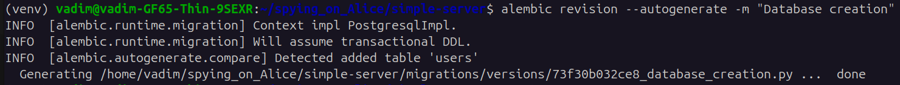
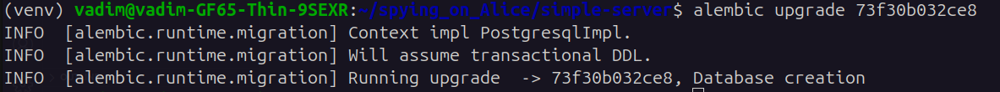

# spying_on_Alice

## Установка базы данных и запуск миграций

### 1. Разверните базу данных из Docker-контейнера

Сначала необходимо загрузить образ PostgreSQL и запустить контейнер:

```
sudo docker pull postgres
```
```
sudo docker run --name db-name -e POSTGRES_PASSWORD=password -d -p 5432:5432 postgres
```

> Здесь -d означает, что контейнер будет работать в фоновом режиме. Порт 5432:5432 — это отображение порта локальной машины на порт внутри контейнера.

### 2. Подключение к контейнеру

Чтобы попасть в контейнер, используйте следующую команду:
```
sudo docker exec -it db-name /bin/bash
```
Затем запустите PostgreSQL:
```
psql -U postgres
```
> Здесь postgres — это имя пользователя для доступа к базе данных.

## Создание миграций

Теперь можно создать миграцию с нужными результатами:





В результате создается таблица users, которая указана в модели.

## Структура миграций

Все версии базы данных хранятся в директории migrations/versions. 

### Откат миграций

Если необходимо откатить изменения или мигрировать к более новой версии, укажите id миграции, который можно найти в версиях.ok
1
